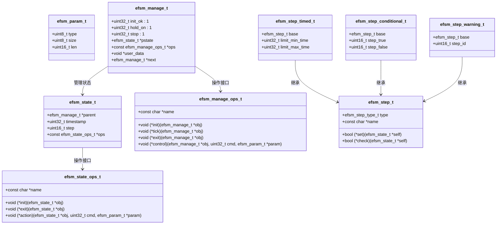
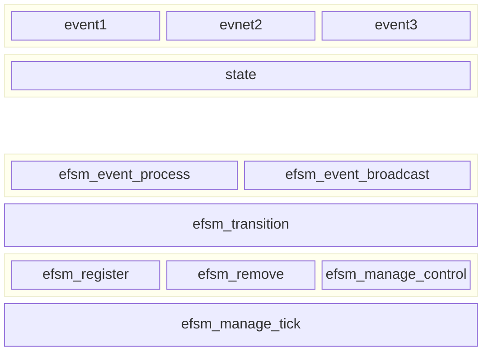

# State Machine Framework (EFSM)

## 项目简介

EFSM（Event-based Finite State Machine，基于事件的有限状态机）是一个轻量级、灵活的嵌入式系统状态机框架。该项目旨在为嵌入式开发者提供一个简单易用、高效可靠的状态机实现，帮助开发者更好地管理复杂的状态切换和事件处理。

主要特性
事件驱动：基于事件触发状态切换，响应快速。
模块化设计：支持自定义状态和步骤，易于扩展。
多类型参数支持：支持多种数据类型的状态机参数传递。
灵活的步骤管理：支持带时间限制、条件判断和异常处理的步骤。
线程化支持：提供周期性任务函数，适合多任务环境。

### EFSM 结构图



---

### 结构图说明

1. **`efsm_param_t`**
   状态机参数结构体，包含参数的类型、大小和长度。

2. **`efsm_state_ops_t`**
   状态操作接口，定义了状态的初始化、退出和事件处理函数。

3. **`efsm_state_t`**
   状态结构体，包含父状态机、时间戳、步骤和操作接口。

4. **`efsm_manage_ops_t`**
   状态机管理操作接口，定义了状态机的初始化、周期性任务、退出和控制函数。

5. **`efsm_manage_t`**
   状态机管理结构体，包含初始化标志、当前状态、操作接口和用户数据。

6. **`efsm_step_t`**
   步骤基类结构体，定义了步骤的类型、名称和操作函数。

7. **`efsm_step_timed_t`**
   带时间限制的步骤结构体，继承自 `efsm_step_t`，增加了时间限制。

8. **`efsm_step_conditional_t`**
   带条件判断的步骤结构体，继承自 `efsm_step_t`，增加了条件判断。

9. **`efsm_step_warning_t`**
   带异常处理的步骤结构体，继承自 `efsm_step_t`，增加了异常状态。


### 分层结构



### 资源占用
```bash
  MODEL_EFSM                       0x2'7330     0x2be  <Block>
    .text              ro code     0x2'7330     0x1bc  efsm.o [1]
    .text              ro code     0x2'74ec     0x102  efsm_step.o [1]
```
## 快速开始

### 1. 安装与配置
将 `efsm.h` 和 `efsm_step.h` 文件包含到您的项目中，并根据需要调用相关接口。

### 2. 基本使用

#### 2.1 初始化状态机
首先，您需要初始化状态机并注册到系统中：

```c
efsm_manage_t my_state_machine;
efsm_manage_init(&my_state_machine);
efsm_register(&my_state_machine);
```

#### 2.2 定义状态和操作
为状态机定义状态及其操作：

```c
static void state_init(efsm_state_t *obj) {
    // 初始化操作
}

static void state_exit(efsm_state_t *obj) {
    // 退出操作
}

static void state_action(efsm_state_t *obj, uint32_t cmd, efsm_param_t *param) {
    // 状态事件处理
}

static const efsm_state_ops_t state_ops = {
    .name = "MyState",
    .init = state_init,
    .exit = state_exit,
    .action = state_action,
};

efsm_state_t my_state = {
    .ops = &state_ops,
};
```

#### 2.3 状态切换
在需要时进行状态切换：

```c
efsm_transition(&my_state_machine, &my_state);
```

#### 2.4 处理事件
通过 `efsm_event_process` 函数处理状态机事件：

```c
efsm_event_process(&my_state_machine, cmd, param);
```

### 3. 步骤管理

#### 3.1 定义步骤
定义状态机步骤，支持带时间限制、条件判断等功能：

```c
static bool step_set(efsm_state_t *self) {
    // 步骤设置操作
    return true;
}

static bool step_check(efsm_state_t *self) {
    // 步骤检查操作
    return true;
}

static const struct efsm_step step = EFSM_STEP_DEFAULT("MyStep", EFSM_STEP_BASE, step_set, step_check);

efsm_step_t steps[] = {&step};
uint16_t step_num = sizeof(steps) / sizeof(steps[0]);
```

#### 3.2 执行步骤
在状态机中执行步骤：

```c
efsm_step_process(&my_state, steps, step_num, tick);
```

## 注意事项
- **线程安全**：在多任务环境中使用时，请确保状态机的操作是线程安全的。
- **内存管理**：请确保动态分配的内存在使用后被正确释放。
- **性能优化**：根据实际需求优化状态机和步骤的执行效率。

## 测试样例
项目已包含测试样例，建议开发者根据实际需求进行进一步测试和验证。

## 贡献与反馈
欢迎提出问题和建议，共同完善 EFSM 项目。

## 许可证
EFSM 项目基于 MIT 许可证开源，详情请参阅项目根目录下的 `LICENSE` 文件。

---

**EFSM 项目** - 为嵌入式系统提供高效的状态机解决方案

**日期**: 2024-01-30
